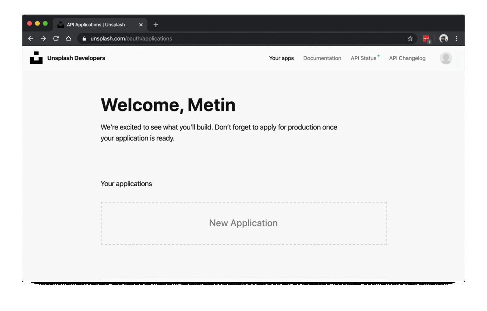

# Assignment 2 - Parallel Programming with Python

[image here](https://carbon.now.sh/?bg=rgba(177%2C196%2C215%2C1)&t=lucario&wt=none&l=auto&ds=true&dsyoff=20px&dsblur=77px&wc=false&wa=false&pv=56px&ph=56px&ln=false&fl=1&fm=Hack&fs=14px&lh=133%25&si=false&es=4x&wm=false&code=)

Welcome!

In this assignment, we will learn how to do parallel programing using python! 

Below, you will find a section that broadly covers things we did in the class, that may or may not relevant with the assignment. However, This [introductory knowledge section](#introductory-knowledge-on-concepts) can be very much benefical for you while doing this assignment! Hence, **reading** it is a few times is crucial for you!

The goal of this assignment is to teach you the difference between serial and parallel programming, and to get your familar with concepts such as *threading*, *multiprocessing*, etc. Enjoy!

## Introductory Knowledge on Concepts

TBD

### Concurrency vs Parallelism

TBD

### Threading and Multiprocessing

TBD

### Packages in Python for Parallel Programming

TBD

### Creating a Developer Account 

## Tasks

In this assignment, you are required to use parallel programming to do the two tasks already done in serial programming.

1. Download images from internet
2. Resize the images you download to thumbnails.

As you will see, when you run the notebook, these tasks are already done using serial programming logic. However, you will see that, the execution of these tasks takes quite a lot of time. 

Your mission, should you choose to accept it, to reduce these timings! 

Following are your list of tasks.

### Setup

- [ ] I created a developer account at [Unsplash Developers](https://unsplash.com/developers).
- [ ] I run the notebook, after running the `Setup the Project` section, it created my `config.ini` file.
- [ ] I added the `access_key` I got from [Unsplash Developers](https://unsplash.com/developers) website to my config file.

### Exploratory Data Analysis Tasks:

- [ ] Explore the dataset 
<!-- TODO: add more tasks -->

### Downloading Images Tasks:

- [ ] I have at least 1500 images with the min qualiy of `regular`.
- [ ] Implemented downloading images with parallel programming logic.
- [ ] Reduce the amount taken in serial way with parallel programming.

### Resizing Images Tasks:

- [ ] Implemented resizing with parallel programming logic.
- [ ] Reduce the amount taken in serial way with parallel programming.

## What are All These Files?

TBD

## Your To-Do List for This Assignment

- [ ] I **have completed** the checkmarks in [Tasks](#tasks) section.
- [ ] My notebook(s) are well organized with headings, comments, that makes it visually appealing.
- [ ] My notebook(s) have the results of my execution.
- [ ] My notebook(s) are reproducible.
- [ ] I download the final version of my repository, and uploaded to the blackboard!
